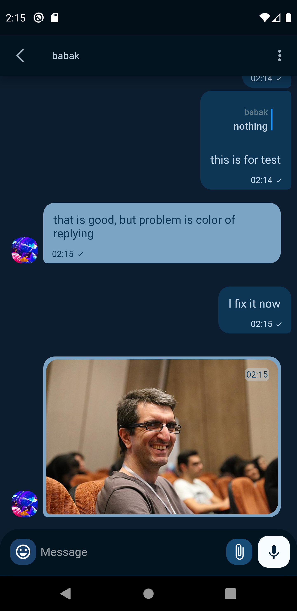
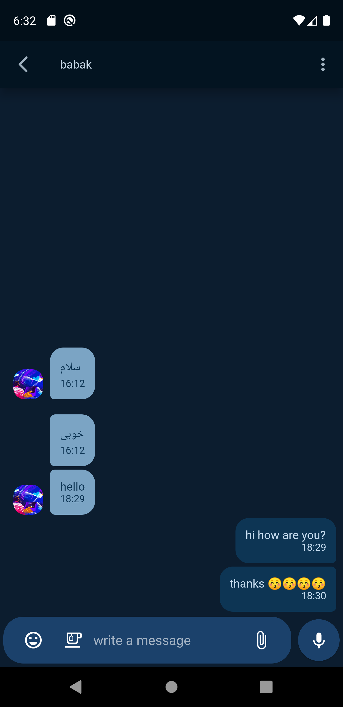
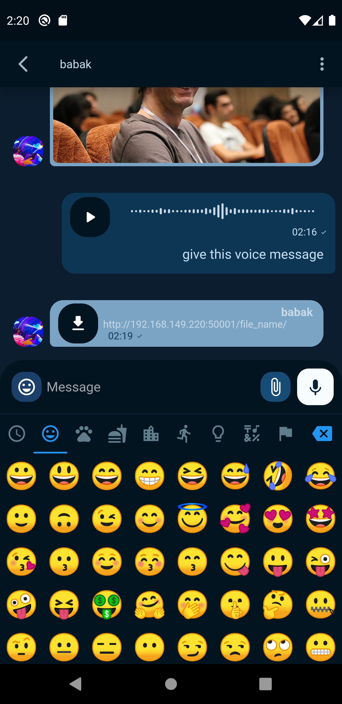
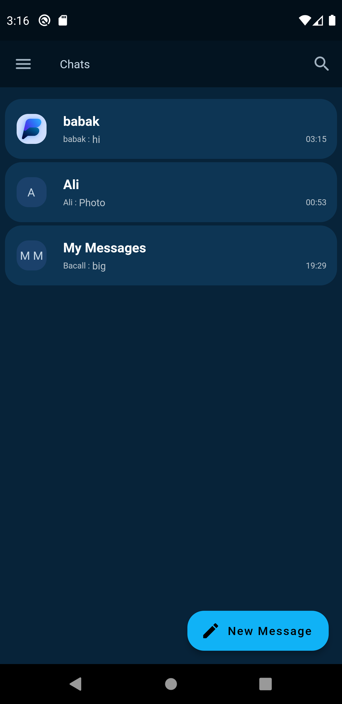
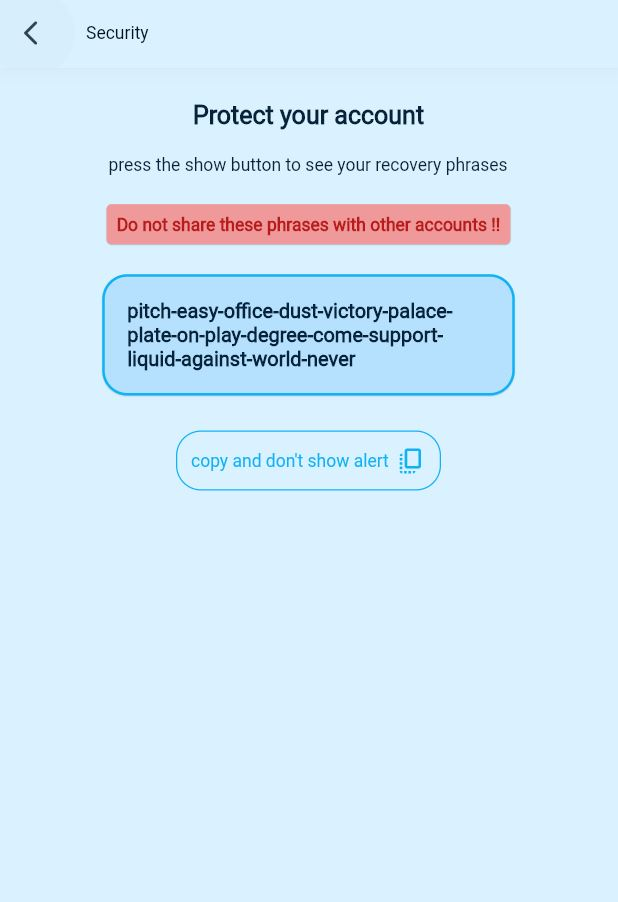
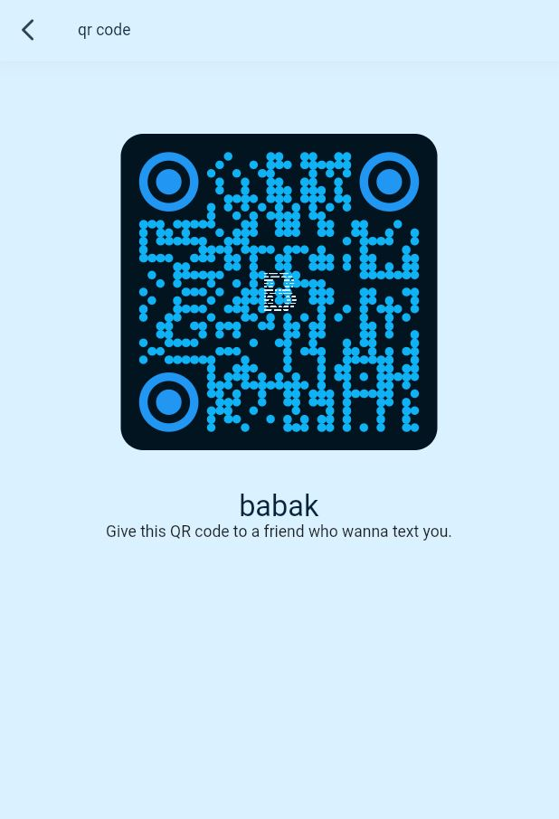

# Business Chat application

A chat application like telegram using **flutter**;

[//]: # (## download applications)

[//]: # (for `android` you can click on the following link address:)

[//]: # ()
[//]: # ([**Android**]&#40;https://github.com/babakcode/business_flutter/releases/download/android/app.apk&#41; 👋)

[//]: # (<br>)

[//]: # (for `web`, `ios` and etc. click on the following link address:)

[//]: # ()
[//]: # ([**PWA Web Application**]&#40;https://chat.babalcode.com/&#41; 😉)

[//]: # (<br>)

[//]: # ()
[//]: # ()
[//]: # (## screenshots)

[//]: # (### android application)

[//]: # (<p float="left">)

[//]: # (  )

[//]: # (   )

[//]: # (  )

[//]: # (  )

[//]: # (  )

[//]: # (  )

[//]: # (</p>)

[//]: # ()
[//]: # ()
[//]: # (### web application)

[//]: # ()
[//]: # (<p float="left">)

[//]: # (  )

[//]: # (   )

[//]: # (</p>)

[//]: # ()
[//]: # ()
[//]: # (## Developers)

[//]: # (Please subscribe into our [Telegram channel]&#40;https://t.me/flutter_geeks&#41; and to conntact with the developer click this [link address.]&#40;https://t.me/babakcode&#41;)

[//]: # (for flutter developers:)

[//]: # (### Getting Started)

[//]: # (```shel)

[//]: # (git clone https://github.com/babakcode/business_flutter.git)

[//]: # (cd business_flutter)

[//]: # (flutter pub get)

[//]: # (flutter run )

[//]: # (```)

this repo will be updated <3 .


## Links

* [Youtube channel](https://www.youtube.com/c/babakcode)
* [Instagram](https://instagram.com/babakcode)
